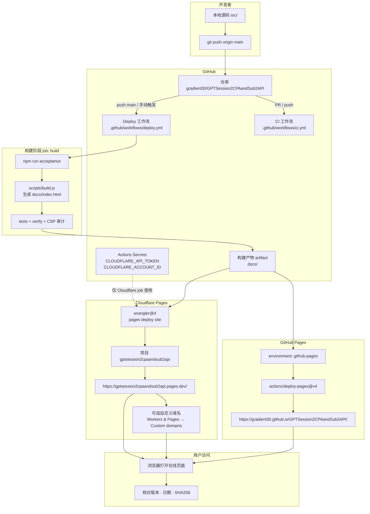

# GitHub → Cloudflare 部署文档

纯静态单页工具（`docs/index.html`）。**一次 push，双平台同步发布。**

| 项 | 值 |
|----|-----|
| GitHub 仓库 | https://github.com/gradient30/GPTSession2CPAandSub2API |
| 工作流文件 | `.github/workflows/deploy.yml` |
| 构建命令 | `npm run acceptance` |
| 发布目录 | `docs/index.html`、`favicon.svg`、`.nojekyll`（构建后打包为 artifact） |

---

## 1. 部署链接总图



### 链接关系（ASCII 简图）

```text
开发者
  │  git push main
  ▼
GitHub 仓库 ─────────────────────────────────────────────┐
  │                                                       │
  ├─[CI] PR/push → npm run acceptance（仅验证，不部署）    │
  │                                                       │
  └─[Deploy] push main / 手动 Run workflow                │
        │                                                 │
        ├─ build → npm run acceptance → artifact(docs/)   │
        │                                                 │
        ├─ deploy-github-pages ──► GitHub Pages           │
        │     https://gradient30.github.io/GPTSession2CPAandSub2API/
        │                                                 │
        └─ deploy-cloudflare-pages ──► Cloudflare Pages   │
              （需 Secrets）          https://gptsession2cpaandsub2api.pages.dev/
                                      └── 可选绑定自定义域名
```

---

## 2. 访问地址一览

| 角色 | 链接 |
|------|------|
| 源码仓库 | https://github.com/gradient30/GPTSession2CPAandSub2API |
| Actions 运行记录 | https://github.com/gradient30/GPTSession2CPAandSub2API/actions |
| Pages 设置 | https://github.com/gradient30/GPTSession2CPAandSub2API/settings/pages |
| Secrets 配置 | https://github.com/gradient30/GPTSession2CPAandSub2API/settings/secrets/actions |
| **GitHub Pages 站点** | https://gradient30.github.io/GPTSession2CPAandSub2API/ |
| **Cloudflare Pages 站点** | https://gptsession2cpaandsub2api.pages.dev/ |
| Cloudflare 控制台 | https://dash.cloudflare.com/ → Workers & Pages |
| Cloudflare API Tokens | https://dash.cloudflare.com/profile/api-tokens |
| 上游 fork 来源 | https://github.com/gtxx3600/GPTSession2CPAandSub2API |

> Cloudflare 默认域名在**首次成功部署后**于控制台确认；自定义域名在 CF 项目页添加。

---

## 3. 一次性配置（Checklist）

按顺序完成，打勾后再首次 `git push`：

- [ ] **1. 推送代码**到 `main`
- [ ] **2. GitHub Pages**：Settings → Pages → Source 选 **GitHub Actions**
- [ ] **3. Cloudflare Token**：推荐 **Account API Token**，权限仅需 `Account → Cloudflare Pages → Edit`（**不要**用 `wrangler whoami` 测 Account Token，会误报权限不足）
- [ ] **4. 复制 Account ID**（CF Dashboard 右侧，32 位十六进制字符串）
- [ ] **5. GitHub Secrets** 写入 `CLOUDFLARE_API_TOKEN`、`CLOUDFLARE_ACCOUNT_ID`
- [ ] **6. 确认未在 CF Pages 绑定同一 GitHub 仓库**（本项目使用 [Direct Upload](https://developers.cloudflare.com/pages/get-started/direct-upload/)，与 CF Git 集成互斥，选一种即可）

### 3.1 配置 Secrets

路径：仓库 → **Settings** → **Secrets and variables** → **Actions**

| Secret | 说明 |
|--------|------|
| `CLOUDFLARE_API_TOKEN` | CF **Account API Token**（`Cloudflare Pages - Edit`） |
| `CLOUDFLARE_ACCOUNT_ID` | CF 账号 ID（必填；仅 Pages 权限的 Token 无法自动查询账号，必须显式配置） |

创建 Token 路径：[Cloudflare API Tokens](https://dash.cloudflare.com/profile/api-tokens) → **Create Token** → **Create Custom Token**：

| 权限 | 级别 |
|------|------|
| Account → Cloudflare Pages | Edit |
| Account Resources | 选择你的账号 |

GitHub Pages 部署使用内置 `GITHUB_TOKEN`，**无需**额外 Secret。

### 3.2 启用 GitHub Pages

1. 打开 [Pages 设置](https://github.com/gradient30/GPTSession2CPAandSub2API/settings/pages)
2. **Build and deployment** → **Source** → **GitHub Actions**
3. 保存

---

## 4. 日常发布流程

```bash
# 1. 本地验收
npm run acceptance

# 2. 提交并推送
git add .
git commit -m "feat: 你的变更说明"
git push origin main

# 3. 查看 Actions（约 2–5 分钟）
#    https://github.com/gradient30/GPTSession2CPAandSub2API/actions
#    确认 Deploy 工作流 3 个 job 均为绿色：
#    build | deploy-github-pages | deploy-cloudflare-pages
```

**触发条件**

| 事件 | CI | Deploy |
|------|----|--------|
| PR | ✅ 验收 | ❌ |
| push `main` | ✅ 验收 | ✅ 双平台部署 |
| Actions 手动 Run | — | ✅ |

---

## 5. 工作流内部结构

文件：`.github/workflows/deploy.yml`

| Job | 依赖 | 输入 | 输出 |
|-----|------|------|------|
| `build` | — | 源码 | artifact `site`（`index.html` + `favicon.svg` + `.nojekyll`） |
| `deploy-github-pages` | `build` | artifact | GitHub Pages 站点 |
| `deploy-cloudflare-pages` | `build` | artifact + CF Secrets | Cloudflare Pages 站点 |

构建链路：

```text
src/template.html + src/lib/* + src/app.js
        ↓  scripts/build.js
docs/index.html（含版本 / SHA256 / CSP）
        ↓  npm run acceptance
artifact（仅静态资源）→ 并行部署 GitHub Pages + Cloudflare Pages
```

### 5.1 与 Cloudflare 官方标准对照

| 官方要求 | 本仓库实现 |
|----------|------------|
| [Direct Upload + CI](https://developers.cloudflare.com/pages/how-to/use-direct-upload-with-continuous-integration/) 使用 `wrangler pages deploy` | ✅ `deploy-cloudflare-pages` job |
| Token 权限：`Account → Cloudflare Pages → Edit` | ✅ 文档与 Secrets 说明一致 |
| 环境变量：`CLOUDFLARE_API_TOKEN`、`CLOUDFLARE_ACCOUNT_ID` | ✅ 部署 job 注入 |
| 项目名：1–58 位小写 + 连字符 | ✅ `gptsession2cpaandsub2api` |
| 先 `pages project create` 再 deploy（非交互 CI） | ✅ 自动检测并创建 |
| 脚本化列举项目用 `pages project list --json` | ✅ 配合 `jq` 判断是否存在 |
| GitHub Actions 权限 `contents: read`、`deployments: write` | ✅ CF deploy job 已配置 |
| 仅上传预构建静态资源目录 | ✅ artifact 不含 `*.md` 文档 |

---

## 6. 部署后验证

1. 打开任一在线地址（见第 2 节）
2. 页头应显示：`v1.1.0 · 日期 · SHA256 xxxxxxxx`
3. 开发者工具查看：`<meta name="build-sha256-full" content="...">`
4. 与本地 `npm run build` 输出或 `dist/SHA256SUMS` 对比

不一致则**不要使用**该页面处理真实 token。详见 [SECURITY.md](../SECURITY.md)。

**功能冒烟（建议）**

- 填入示例 → 切换 7 种输出格式 → 复制 / 下载 → 清空输入
- DevTools → Network：除主动点击外链外应为 **0 请求**

---

## 7. 自定义域名（Cloudflare）

1. [Cloudflare Dashboard](https://dash.cloudflare.com/) → **Workers & Pages**
2. 选择项目 `gptsession2cpaandsub2api`
3. **Custom domains** → 添加域名 → 按提示配置 DNS

GitHub Pages 自定义域名：在 Pages 设置中单独配置（与 CF 独立）。

---

## 8. 常见问题

| 现象 | 处理 |
|------|------|
| Cloudflare job 红，`invalid project name` / `8000003` | Pages 项目名须 **1–58 位小写字母与连字符**（不能含大写）。本项目使用 `gptsession2cpaandsub2api` |
| Cloudflare job 红，`Project not found` / `8000007` | CF 账号中尚无该 Pages 项目。工作流会自动 `pages project create`；若仍失败，在本地执行 `npx wrangler pages project create gptsession2cpaandsub2api --production-branch=main` 或于 CF 控制台手动创建 |
| Cloudflare job 红，`whoami` / `retrieve account IDs` | **正常现象**：仅 Pages Edit 的 Account Token 不支持 `wrangler whoami`。工作流已改为只校验 Secret 是否存在，直接执行 `pages deploy`；请确认 `CLOUDFLARE_ACCOUNT_ID` 已填写且正确 |
| Cloudflare job 红，`npx` exit code 1（deploy 步骤） | 展开 `Deploy to Cloudflare Pages`：Authentication error 检查 Token/Account ID；项目冲突则检查 CF 控制台是否已用 Git 集成重复绑定 |
| Cloudflare job 红，Authentication error | Token 需含 **Account - Cloudflare Pages: Edit**；`CLOUDFLARE_ACCOUNT_ID` 必须为 Dashboard 右侧的 32 位账号 ID |
| GitHub Pages 404 | 确认 Source 为 GitHub Actions；等待 1–3 分钟 |
| Deploy 未触发 | 确认推送到 `main`；或 Actions 页手动 Run workflow |
| 两平台内容不一致 | 同一 artifact 部署，若不一致多为 CDN 缓存，强刷或等几分钟 |
| 只想部署一个平台 | 编辑 `deploy.yml` 删除不需要的 deploy job |
| CF 与 GitHub 重复部署 | 关闭 CF Pages 的 Git 集成，仅用 Actions Direct Upload 推送 |
| 误把仓库名当 CF 项目名 | GitHub 仓库名可含大写；CF Pages 项目名必须全小写，见 `CF_PAGES_PROJECT` |

---

## 9. 相关文件

| 文件 | 作用 |
|------|------|
| `.github/workflows/deploy.yml` | 双平台部署 |
| `.github/workflows/ci.yml` | PR 验收 |
| `scripts/build.js` | 生成 `docs/index.html` |
| `scripts/acceptance.js` | 全量验收 |
| `docs/RELEASE.md` | 版本 tag / Release 附件 |
| `docs/AUDIT_CHECKLIST.md` | 发布前审核清单 |

---

## 10. 安全提醒

- 处理真实 token 时，优先信任**本 fork 构建**的页面，并核对 SHA256
- 不要在 Issues / PR 中粘贴 session JSON
- 在线页面仅做本地格式转换，不上传凭证（见 [SECURITY.md](../SECURITY.md)）
