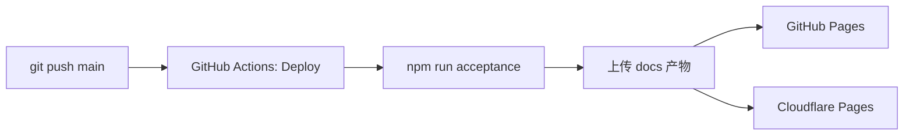

# 部署指南：GitHub Pages + Cloudflare Pages 自动同步

本仓库为**纯静态单页**（`docs/index.html`）。推送到 `main` 后，GitHub Actions 会：

1. 执行 `npm run acceptance`（构建 + 测试 + 验收）
2. 部署到 **GitHub Pages**
3. 同步部署到 **Cloudflare Pages**

---

## 一、一次性准备

### 1. 推送代码到 GitHub

```bash
git add .
git commit -m "chore: add dual deploy workflow"
git push origin main
```

仓库地址示例：`https://github.com/gradient30/GPTSession2CPAandSub2API`

### 2. 启用 GitHub Pages（Actions 源）

1. 打开 GitHub 仓库 → **Settings** → **Pages**
2. **Build and deployment** → **Source** 选择 **GitHub Actions**
3. 保存（首次 push 触发 `Deploy` 工作流后才会出现站点）

部署成功后访问：

```text
https://<你的用户名>.github.io/GPTSession2CPAandSub2API/
```

示例：`https://gradient30.github.io/GPTSession2CPAandSub2API/`

### 3. 创建 Cloudflare API Token

1. 登录 [Cloudflare Dashboard](https://dash.cloudflare.com/)
2. 右上角头像 → **My Profile** → **API Tokens**
3. **Create Token** → 使用模板 **Edit Cloudflare Workers** 或自定义：
   - 权限：**Account** → **Cloudflare Pages** → **Edit**
   - 账户范围：选择你的账号
4. 复制生成的 Token（只显示一次）

### 4. 获取 Cloudflare Account ID

1. Cloudflare Dashboard 首页右侧 **Account ID**
2. 或进入任意域名 → Overview → 右侧 **Account ID**

### 5. 在 GitHub 配置 Secrets

仓库 → **Settings** → **Secrets and variables** → **Actions** → **New repository secret**

| Secret 名称 | 值 |
|-------------|-----|
| `CLOUDFLARE_API_TOKEN` | 上一步创建的 Token |
| `CLOUDFLARE_ACCOUNT_ID` | 你的 Account ID |

可选 **Variables**（非敏感）：

| Variable 名称 | 值 | 说明 |
|---------------|-----|------|
| `CLOUDFLARE_PAGES_PROJECT` | `GPTSession2CPAandSub2API` | Cloudflare Pages 项目名，默认同仓库名 |

### 6. 重要：勿重复绑定 Cloudflare Git 集成

若使用本仓库的 **GitHub Actions 部署 Cloudflare**，请**不要**在 Cloudflare Pages 里再连接同一 GitHub 仓库，否则会出现**重复构建/重复部署**。

正确做法：**仅由 GitHub Actions** 调用 `wrangler pages deploy` 推送到 Cloudflare。

---

## 二、自动部署流程



触发条件（见 `.github/workflows/deploy.yml`）：

- 推送到 `main` / `master`
- 或在 Actions 页手动 **Run workflow**

### 工作流任务说明

| Job | 作用 |
|-----|------|
| `build` | 验收构建，打包 `docs/` 为 artifact |
| `deploy-github-pages` | 发布到 GitHub Pages |
| `deploy-cloudflare-pages` | 发布到 Cloudflare Pages |

PR 仅跑 CI（`.github/workflows/ci.yml`），**不会**自动部署。

---

## 三、部署后访问地址

| 平台 | 地址 |
|------|------|
| GitHub Pages | `https://<user>.github.io/GPTSession2CPAandSub2API/` |
| Cloudflare Pages | `https://<project-name>.pages.dev/`（首次部署后在 CF 控制台查看） |

### 自定义域名（Cloudflare）

1. Cloudflare Dashboard → **Workers & Pages** → 你的项目
2. **Custom domains** → 添加域名
3. 按提示配置 DNS（若域名已在 Cloudflare，通常一键完成）

### 校验部署未被篡改

打开在线页面，核对页头：

```text
v1.1.0 · 2026-xx-xx · SHA256 xxxxxxxx
```

与仓库 `dist/SHA256SUMS` 或 Release 附件对比。详见 [SECURITY.md](../SECURITY.md)。

---

## 四、本地预发布检查

```bash
npm run acceptance
```

确认通过后，再 push：

```bash
git push origin main
```

在 GitHub **Actions** 页查看 `Deploy` 工作流三条 job 均为绿色。

---

## 五、常见问题

### Cloudflare 部署失败：`Authentication error`

- 检查 `CLOUDFLARE_API_TOKEN` 是否过期、权限是否含 **Pages Edit**
- 检查 `CLOUDFLARE_ACCOUNT_ID` 是否正确

### GitHub Pages 404

- 确认 Settings → Pages → Source 为 **GitHub Actions**
- 首次部署需等待 1–3 分钟
- 私有仓库需 GitHub Pro 才能用 Pages（公开仓库无此限制）

### 只想部署其中一个平台

- 仅 GitHub Pages：删除 `deploy.yml` 中 `deploy-cloudflare-pages` job
- 仅 Cloudflare：删除 `deploy-github-pages` job，并可在 CF 改用 Git 直连集成

### 构建日期/SHA256 每次部署会变吗？

- **日期**：按 UTC 构建日写入，同一天多次部署相同
- **SHA256**：仅当 `src/` 源码变化时改变

---

## 六、相关文件

| 文件 | 说明 |
|------|------|
| `.github/workflows/deploy.yml` | 双平台部署工作流 |
| `.github/workflows/ci.yml` | PR / push 验收（不部署） |
| `docs/RELEASE.md` | 版本发布与 Release 附件 |
| `docs/AUDIT_CHECKLIST.md` | 发布前审核清单 |
